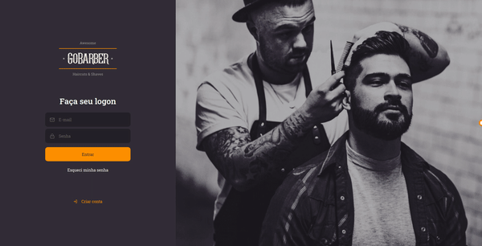

<p align="center">

</p>

<h1 align="center">
    
</h1>

## 🚀 About application

- This application is the Gobarber app for scheduling services.
- The application was made using ReactJS, Typescript, and lib axios to connect to api.

## 🔥️ Technologies used

The project was developed using the following technologies:

- [ReactJS](https://pt-br.reactjs.org/)
- [Typescript](https://www.typescriptlang.org/)
- [Axios](https://github.com/axios/axios)
- [Unform](https://unform.dev/)
- [Styled Components](https://styled-components.com/)

## ⚡️ How to download the project

```bash

    # Clone the repository
    $ git clone https://github.com/PabloMelo11/gobarber-reactjs.git

    # Enter directory
    $ cd gobarber-reactjs

    # Install the dependencies
    $ yarn install

    # Start the project
    $ yarn start
```

---

Created with ❤️ by Pablo Melo
